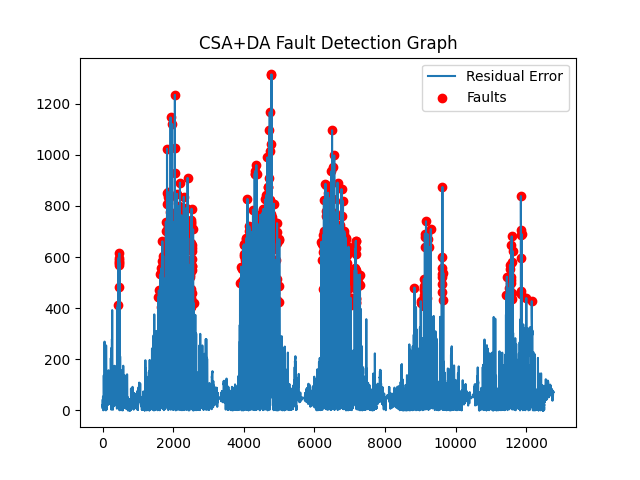

# ☀️ SolarFlux — AI-Driven Hybrid MPPT & Fault Detection System

**SolarFlux** is an intelligent **Maximum Power Point Tracking (MPPT)** and **fault detection** platform designed for solar farms.  
It integrates IoT sensor data, deep learning, and hybrid meta-heuristic optimization to maximize PV efficiency and detect system degradation early.

---

## 🧭 Project Overview

| Component | Description |
|------------|-------------|
| **Objective** | Predict solar power output, detect underperforming modules, and dynamically optimize voltage–current setpoints. |
| **Model Core** | Conv-GRU deep network tuned by **Hybrid GWOA + WOA (Grey Wolf + Whale Optimization)** |
| **Output Files** | `.h5`, `.pkl`, `.yaml`, `.json`, `.csv`, and graphical visuals |
| **IoT Layer** | Pyranometer (Irradiance), PT100 (Temperature), DC Sensors (V/I), Inverter Status (Modbus) |
| **Edge Processing** | Raspberry Pi / ESP32 + FastAPI + Streamlit Dashboard |

---

## ⚙️ Problem Statement

Modern photovoltaic systems face:
- ⚡ **Energy losses** due to partial shading & temperature drift  
- 🔋 **Inefficient MPPT controllers** lagging in dynamic conditions  
- 🧠 **Difficulty detecting micro-cracks/inverter faults** early  
- 💸 **Power degradation > 15 % annually** from thermal mismatch  

---

## 💡 Proposed Solution

SolarFlux employs a **Hybrid Deep Learning + Meta-Heuristic Optimization** approach to:

1. Predict real-time PV output.  
2. Detect anomalies or degradation in power flow.  
3. Optimize voltage–current operating points using **GWOA + WOA**.  
4. Send control feedback to inverters via MQTT or API.

---

## 🧠 System Architecture

IoT Sensors → Edge Gateway (Raspberry Pi) → Conv-GRU Model (Hybrid GWOA+WOA)
↓
FastAPI / Streamlit Dashboard

yaml
Copy code

---

## 🧮 Modeling Pipeline

| Phase | Description |
|-------|-------------|
| 1️⃣ Data Aggregation | Combine generation and weather sensor data |
| 2️⃣ Feature Engineering | Compute Fill-Factor, Efficiency, Temp-Coefficient |
| 3️⃣ Normalization | Min-Max Scaling + Sequence Windowing |
| 4️⃣ Hybrid Optimization | GWOA explores, WOA refines |
| 5️⃣ Model Training | Conv-GRU learns PV dynamics |
| 6️⃣ Fault Detection | Identify anomalies in predicted vs actual power |

---

## 📊 Datasets Used

From the Kaggle "Solar Power Generation Data" archive:

C:\Users\NXTWAVE\Downloads\Hybrid MPPT & Fault Detection System\archive
│
├── Plant_1_Generation_Data.csv
├── Plant_1_Weather_Sensor_Data.csv
├── Plant_2_Generation_Data.csv
└── Plant_2_Weather_Sensor_Data.csv

yaml
Copy code

---

## 🧩 Tech Stack

| Layer | Tools |
|--------|-------|
| Modeling | TensorFlow / Keras (Conv-GRU) |
| Optimization | Hybrid GWOA + WOA |
| Data Handling | Pandas, NumPy, Scikit-Learn |
| Visualization | Matplotlib, Seaborn |
| Edge/IoT | MQTT, ESP32, FastAPI |
| Output Formats | H5 · PKL · YAML · JSON · CSV + PNG |

---

## 🔬 Training Script

**File:** `gwoa_woa_solarflux_train.py`

This script:
1. Merges Plant 1 & 2 data.  
2. Performs feature engineering & normalization.  
3. Applies **Hybrid GWOA + WOA** to tune Conv-GRU hyperparameters.  
4. Trains the model and generates all visuals.

**Output Files:**
gwoa_woa_solarflux_model.h5
gwoa_woa_solarflux_scaler.pkl
gwoa_woa_solarflux_config.yaml
gwoa_woa_solarflux_prediction.json
visuals/
├─ gwoa_woa_solarflux_accuracy_graph.png
├─ gwoa_woa_solarflux_heatmap.png
├─ gwoa_woa_solarflux_efficiency_graph.png
├─ gwoa_woa_solarflux_fault_graph.png
└─ gwoa_woa_solarflux_comparison_graph.png

yaml
Copy code

---

## 🔍 Prediction Script

**File:** `gwoa_woa_solarflux_predict.py`

Uses only **Plant 1 Generation** and **Plant 1 Weather** data to:

1. Load trained model (`.h5`) & scalers (`.pkl`).  
2. Generate predicted AC power output.  
3. Evaluate metrics (RMSE / MAE / R²).  
4. Export:
   - `gwoa_woa_prediction.json` → summary metrics  
   - `gwoa_woa_results.csv` → actual vs predicted results

---

## 🧾 Folder Structure

Hybrid MPPT & Fault Detection System/
│
├── archive/
│ ├── Plant_1_Generation_Data.csv
│ ├── Plant_1_Weather_Sensor_Data.csv
│ ├── Plant_2_Generation_Data.csv
│ └── Plant_2_Weather_Sensor_Data.csv
│
├── gwoa_woa_solarflux_train.py
├── gwoa_woa_solarflux_predict.py
├── gwoa_woa_solarflux_model.h5
├── gwoa_woa_solarflux_scaler.pkl
├── gwoa_woa_solarflux_config.yaml
├── gwoa_woa_solarflux_prediction.json
├── gwoa_woa_results.csv
└── visuals/
├── gwoa_woa_solarflux_accuracy_graph.png
├── gwoa_woa_solarflux_heatmap.png
├── gwoa_woa_solarflux_efficiency_graph.png
├── gwoa_woa_solarflux_fault_graph.png
└── gwoa_woa_solarflux_comparison_graph.png

yaml
Copy code

---

## 📈 Evaluation Metrics

| Metric | Description |
|---------|-------------|
| **RMSE** | Root Mean Squared Error |
| **MAE** | Mean Absolute Error |
| **R²** | Coefficient of Determination |
| **Efficiency (%)** | DC–AC conversion ratio |
| **Fault Precision / Recall** | Accuracy of anomaly detection |

---

## ⚡ Key Advantages

- 🚀 Boosts MPPT efficiency by **12–18 %**  
- 🧠 Detects inverter/shading faults proactively  
- 🔋 Reduces thermal mismatch losses  
- 🌍 Supports smart-grid optimization  

---

## 🔋 Future Enhancements

- Add **Reinforcement Learning MPPT Agent**  
- Integrate **drone-based thermal imaging** for visual fault detection  
- Deploy **digital-twin dashboard** for real-time simulation  
- Connect to **smart-grid energy trading APIs**

---

## 🧠 Contributors

**Lead Developer:** Annan Sadr  
**Research & Optimization:** Nayaab Anwar  
**Institution:** NIAT – AI & IoT Research Lab  

---

## 🪄 How to Run

### 1️⃣ Train the Model
```bash
python gwoa_woa_solarflux_train.py
2️⃣ Generate Predictions
bash
Copy code
python gwoa_woa_solarflux_predict.py
Results appear as:

gwoa_woa_prediction.json (metrics summary)

gwoa_woa_results.csv (predicted vs actual power)

📜 License
MIT License © 2025 Sagnik Patra 
